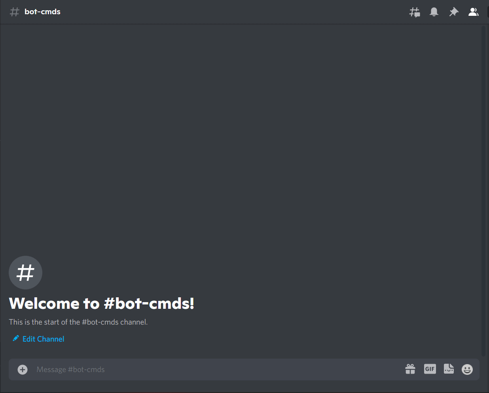

# Checkers

### What is Checkers

Checkers is a group of strategy board games for two players which involve diagonal moves of uniform game pieces and mandatory captures by jumping over opponent pieces

Source: [Wikipedia](https://en.wikipedia.org/wiki/Checkers)

### How to play

!!! warning

    Replace {prefix} with the prefix of your bot.

`{prefix}checkers [@user]`

!!! info  inline end
    Member is required parameter.

| Name | Requested Type |
| :-- | :-- |
| **Member** | Member ([discord.Member](https://discordpy.readthedocs.io/en/latest/api.html?highlight=member#discord.Member) e.g @user) |

### Permissions

??? tdlr "Permissions Required"
    | Name | Description |
    | :-- | :-- |
    | **Manage messages** | Manage messages |
    | **Send messages** | Send messages |
    | **Embed links** | Sending embeds |
    | **Add reactions** | Add reactions for games |

### Errors

??? tdlr "Possible Errors"
    | Name | Reason |
    | :-- | :-- |
    | **Member is required** | You did not input a user (Mention the user) |
    | **MissingPermissions** ([discord.ext.commands.BotMissingPermissions](https://discordpy.readthedocs.io/en/latest/ext/commands/api.html?highlight=missing#discord.ext.commands.BotMissingPermissions)) | You did not give the bot permission for it to play the game |
    | **Message NotFound** ([discord.NotFound](https://discordpy.readthedocs.io/en/latest/api.html?highlight=notfound#discord.NotFound)) | The message was deleted |
    | **TimeoutError** ([asyncio.TimeoutError](https://docs.python.org/3/library/asyncio-exceptions.html?highlight=timeouterror#asyncio.TimeoutError)) | You did not answer/respond in time. |

!!! tip
    If the error you got is not documented. Feel free to contribute [here](https://github.com/andrewthederp/Disgames/docs/mixins/checkers.md)
