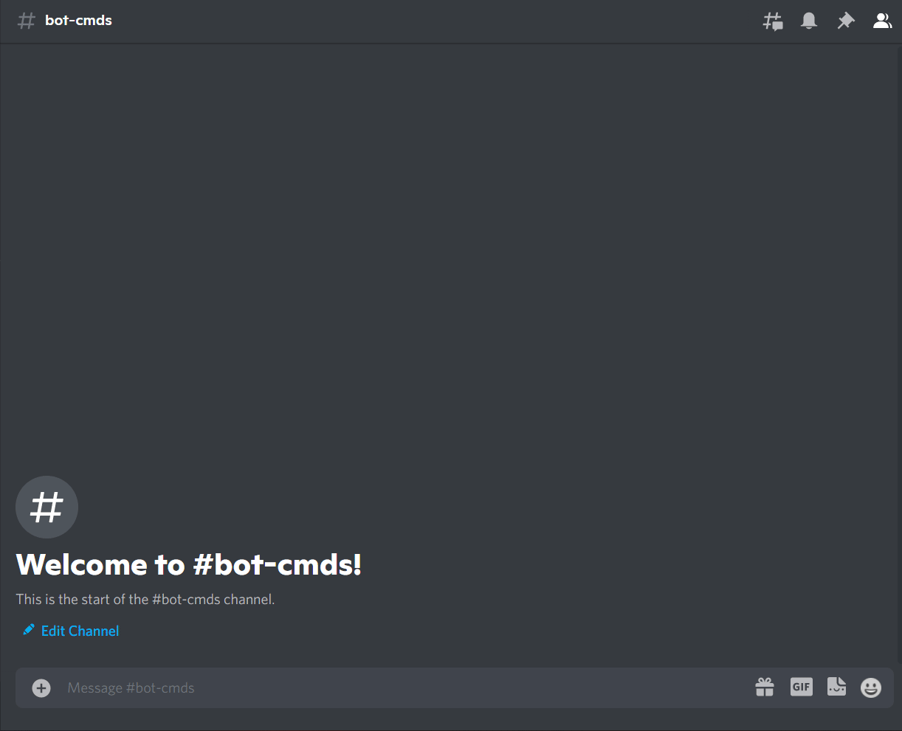

# Chess

### What is Chess

Chess is an abstract strategy game and involves no hidden information. It is played on a square chessboard with 64 squares arranged in an eight-by-eight grid. At the start, each player (one controlling the white pieces, the other controlling the black pieces) controls sixteen pieces: one king, one queen, two rooks, two knights, two bishops, and eight pawns. The object of the game is to checkmate the opponent's king, whereby the king is under immediate attack (in "check") and there is no way for it to escape. There are also several ways a game can end in a draw.

Source: [Wikipedia](https://en.wikipedia.org/wiki/Chess)

### How to play

!!! warning

    Replace {prefix} with the prefix of your bot.

`{prefix}chess [@user]`

!!! info  inline end
    Member is not required parameter.

    If you do not input a user, the bot will play against you.

| Name | Requested Type |
| :-- | :-- |
| **Member** | Member ([discord.Member](https://discordpy.readthedocs.io/en/latest/api.html?highlight=member#discord.Member) e.g @user) |

### Permissions

??? tdlr "Permissions Required"
    | Name | Description |
    | :-- | :-- |
    | **Manage messages** | Manage messages |
    | **Send messages** | Send messages |
    | **Embed links** | Sending embeds |

### Errors

??? tdlr "Possible Errors"
    | Name | Reason |
    | :-- | :-- |
    | **StockFish Path is not found** | You did not input a stockfish path |
    | **MissingPermissions** ([discord.ext.commands.BotMissingPermissions](https://discordpy.readthedocs.io/en/latest/ext/commands/api.html?highlight=missing#discord.ext.commands.BotMissingPermissions)) | You did not give the bot permission for it to play the game |
    | **Message NotFound** ([discord.NotFound](https://discordpy.readthedocs.io/en/latest/api.html?highlight=notfound#discord.NotFound)) | The message was deleted |
    | **TimeoutError** ([asyncio.TimeoutError](https://docs.python.org/3/library/asyncio-exceptions.html?highlight=timeouterror#asyncio.TimeoutError)) | You did not answer/respond in time. |
    | Invalid Move | You input an invalid move |

!!! tip
    If the error you got is not documented. Feel free to contribute [here](https://github.com/andrewthederp/Disgames/docs/mixins/chess.md)
