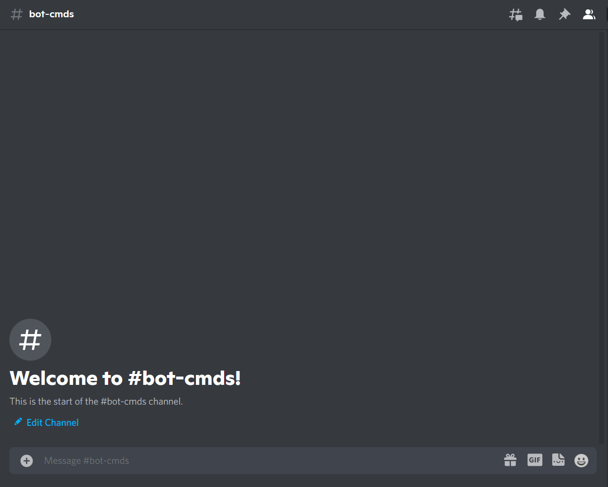

# Connect4

!!! danger
    Connect4 AI right now is broken and will be fixed soon.

### What is Connect4

Connect Four is a two-player connection board game, in which the players choose a color and then take turns dropping colored discs into a seven-column, six-row vertically suspended grid. The pieces fall straight down, occupying the lowest available space within the column. The objective of the game is to be the first to form a horizontal, vertical, or diagonal line of four of one's own discs. Connect Four is a solved game. The first player can always win by playing the right moves.

Source: [Wikipedia](https://en.wikipedia.org/wiki/Connect_Four)

### How to play

!!! warning

    Replace {prefix} with the prefix of your bot.

`{prefix}connect4 [@user]`

!!! info  inline end
    Member is not required parameter.

    If you do not input a user, the bot will play against you.

| Name | Requested Type |
| :-- | :-- |
| **Member** | Member ([discord.Member](https://discordpy.readthedocs.io/en/latest/api.html?highlight=member#discord.Member) e.g @user) |

### Permissions

??? tdlr "Permissions Required"
    | Name | Description |
    | :-- | :-- |
    | **Manage messages** | Manage messages |
    | **Send messages** | Send messages |
    | **Embed links** | Sending embeds |

### Errors

??? tdlr "Possible Errors"
    | Name | Reason |
    | :-- | :-- |
    | **MissingPermissions** ([discord.ext.commands.BotMissingPermissions](https://discordpy.readthedocs.io/en/latest/ext/commands/api.html?highlight=missing#discord.ext.commands.BotMissingPermissions)) | You did not give the bot permission for it to play the game |
    | **Message NotFound** ([discord.NotFound](https://discordpy.readthedocs.io/en/latest/api.html?highlight=notfound#discord.NotFound)) | The message was deleted |
    | **TimeoutError** ([asyncio.TimeoutError](https://docs.python.org/3/library/asyncio-exceptions.html?highlight=timeouterror#asyncio.TimeoutError)) | You did not answer/respond in time. |

!!! tip
    If the error you got is not documented. Feel free to contribute [here](https://github.com/andrewthederp/Disgames/docs/mixins/connect4.md)
