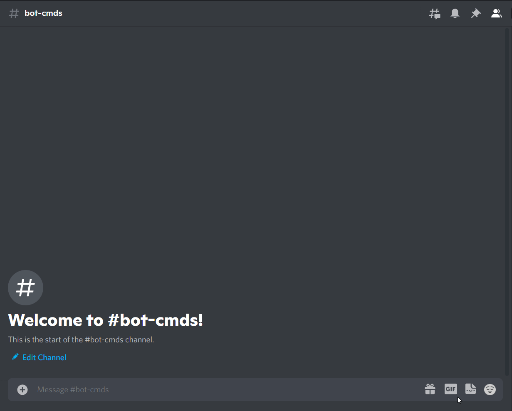

# Hangman

### What is Hangman

Hangman is a paper and pencil guessing game for two or more players. One player thinks of a word, phrase or sentence and the other(s) tries to guess it by suggesting letters within a certain number of guesses.

Source: [Wikipedia](https://en.wikipedia.org/wiki/Hangman_(game))

### How to play

!!! warning

    Replace {prefix} with the prefix of your bot.

`{prefix}hangman`

!!! info
    There is no parameter required.

### Permissions

??? tdlr "Permissions Required"
    | Name | Description |
    | :-- | :-- |
    | **Manage messages** | Manage messages |
    | **Send messages** | Send messages |
    | **Embed links** | Sending embeds |

### Errors

??? tdlr "Possible Errors"
    | Name | Reason |
    | :-- | :-- |
    | **MissingPermissions** ([discord.ext.commands.BotMissingPermissions](https://docs.pycord.dev/en/master/ext/commands/api.html?highlight=missing#discord.ext.commands.BotMissingPermissions)) | You did not give the bot permission for it to play the game |
    | **Message NotFound** ([discord.NotFound](https://docs.pycord.dev/en/master/api.html?highlight=notfound#discord.NotFound)) | The message was deleted |
    | **TimeoutError** ([asyncio.TimeoutError](https://docs.python.org/3/library/asyncio-exceptions.html?highlight=timeouterror#asyncio.TimeoutError)) | You did not answer/respond in time. |

!!! tip
    If the error you got is not documented. Feel free to contribute [here](https://github.com/andrewthederp/Disgames/docs/mixins/hangman.md)
