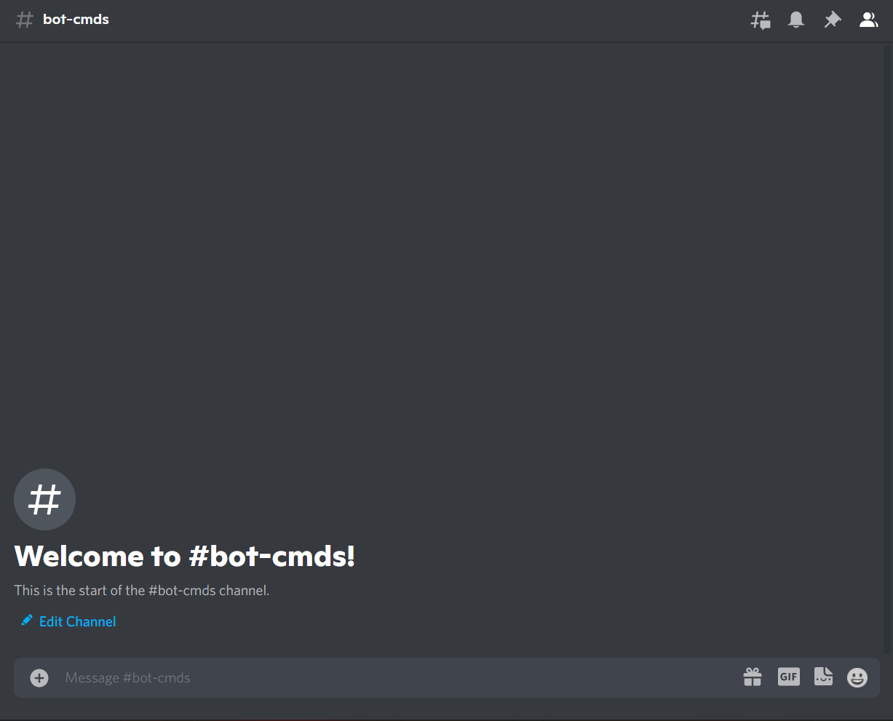

# Minesweeper

### What is Minesweeper

Minesweeper is a single-player puzzle video game. The objective of the game is to clear a rectangular board containing hidden "mines" or bombs without detonating any of them, with help from clues about the number of neighbouring mines in each field. The game originates from the 1960s, and it has been written for many computing platforms in use today. It has many variations and offshoots.

Source: [Wikipedia](https://en.wikipedia.org/wiki/Minesweeper_(video_game))

### How to play

!!! warning

    Replace {prefix} with the prefix of your bot.

`{prefix}minesweeper`

!!! info  inline end
    There are no parameter required.

### Permissions

??? tdlr "Permissions Required"
    | Name | Description |
    | :-- | :-- |
    | **Manage messages** | Manage messages |
    | **Send messages** | Send messages |
    | **Embed links** | Sending embeds |

### Errors

??? tdlr "Possible Errors"
    | Name | Reason |
    | :-- | :-- |
    | **MissingPermissions** ([discord.ext.commands.BotMissingPermissions](https://docs.pycord.dev/en/master/ext/commands/api.html?highlight=missing#discord.ext.commands.BotMissingPermissions)) | You did not give the bot permission for it to play the game |
    | **TimeoutError** ([asyncio.TimeoutError](https://docs.python.org/3/library/asyncio-exceptions.html?highlight=timeouterror#asyncio.TimeoutError)) | You did not answer/respond in time. |
    | **Message NotFound** ([discord.NotFound](https://docs.pycord.dev/en/master/api.html?highlight=notfound#discord.NotFound)) | The message was deleted |

!!! tip
    If the error you got is not documented. Feel free to contribute [here](https://github.com/andrewthederp/Disgames/docs/mixins/minesweeper.md)
