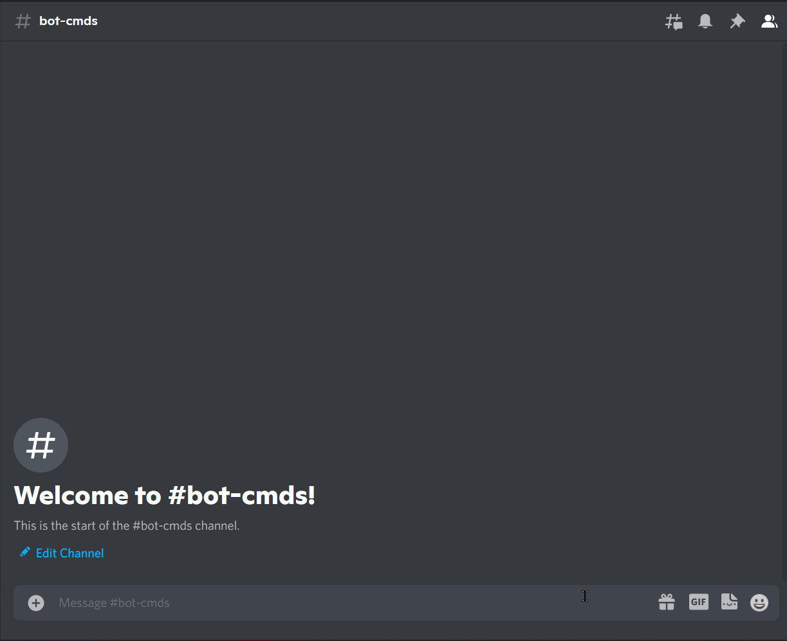

# RPS

### What is RPS

RPS is rock paper scissors - Rock paper scissors is a hand game, usually played between two people, in which each player simultaneously forms one of three shapes with an outstretched hand. These shapes are "rock" (a closed fist), "paper" (a flat hand), and "scissors" (a fist with the index finger and middle finger extended, forming a V). "Scissors" is identical to the two-fingered V sign (also indicating "victory" or "peace") except that it is pointed horizontally instead of being held upright in the air.

Source: [Wikipedia](https://en.wikipedia.org/wiki/Rock-paper-scissors)

### How to play

!!! warning

    Replace {prefix} with the prefix of your bot.

`{prefix}rps [@user]`

!!! info  inline end
    Member is not required parameter.

    If you do not input a user, the bot will play against you.

| Name | Requested Type |
| :-- | :-- |
| **Member** | Member ([discord.Member](https://docs.pycord.dev/en/master/api.html?highlight=member#discord.Member) e.g @user) |

### Permissions

??? tdlr "Permissions Required"
    | Name | Description |
    | :-- | :-- |
    | **Manage messages** | Manage messages |
    | **Send messages** | Send messages |
    | **Embed links** | Sending embeds |

### Errors

??? tdlr "Possible Errors"
    | Name | Reason |
    | :-- | :-- |
    | **MissingPermissions** ([discord.ext.commands.BotMissingPermissions](https://docs.pycord.dev/en/master/ext/commands/api.html?highlight=missing#discord.ext.commands.BotMissingPermissions)) | You did not give the bot permission for it to play the game |
    | **Message NotFound** ([discord.NotFound](https://docs.pycord.dev/en/master/api.html?highlight=notfound#discord.NotFound)) | The message was deleted |
    | **TimeoutError** ([asyncio.TimeoutError](https://docs.python.org/3/library/asyncio-exceptions.html?highlight=timeouterror#asyncio.TimeoutError)) | You did not answer/respond in time. |

!!! tip
    If the error you got is not documented. Feel free to contribute [here](https://github.com/andrewthederp/Disgames/docs/mixins/rps.md)
