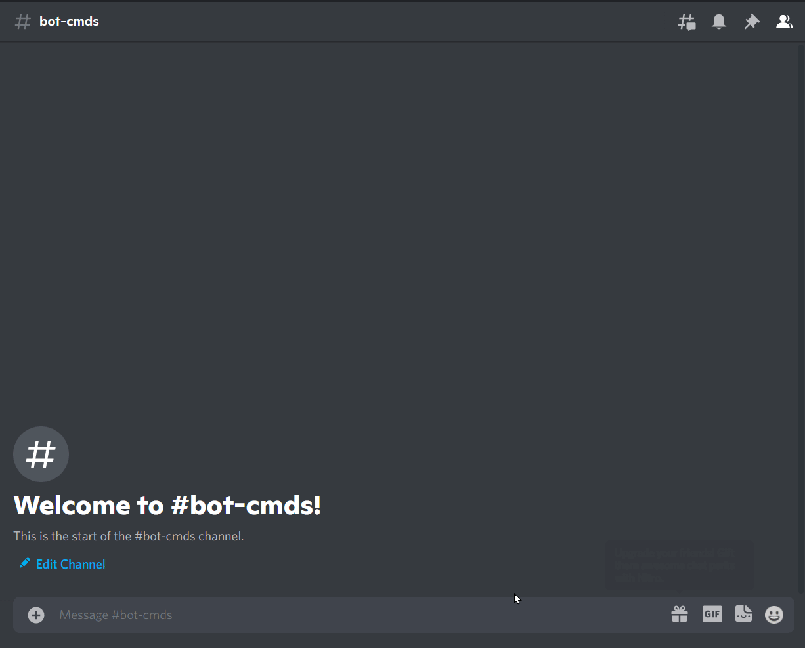

# Sudoku

### What is Sodoku

Sudoku is a logic-based combinatorial number-placement puzzle. In classic sudoku, the objective is to fill a 9 × 9 grid with digits so that each column, each row, and each of the nine 3 × 3 subgrids that compose the grid (also called "boxes", "blocks", or "regions") contain all of the digits from 1 to 9. The puzzle setter provides a partially completed grid, which for a well-posed puzzle has a single solution.

Source: [Wikipedia](https://en.wikipedia.org/wiki/Sudoku)

### How to play

!!! warning

    Replace {prefix} with the prefix of your bot.

`{prefix}sudoku`

!!! info  inline end
    There are no parameter required.

### Permissions

??? tdlr "Permissions Required"
    | Name | Description |
    | :-- | :-- |
    | **Manage messages** | Manage messages |
    | **Send messages** | Send messages |
    | **Embed links** | Sending embeds |

### Errors

??? tdlr "Possible Errors"
    | Name | Reason |
    | :-- | :-- |
    | **MissingPermissions** ([discord.ext.commands.BotMissingPermissions](https://discordpy.readthedocs.io/en/latest/ext/commands/api.html?highlight=missing#discord.ext.commands.BotMissingPermissions)) | You did not give the bot permission for it to play the game |
    | **TimeoutError** ([asyncio.TimeoutError](https://docs.python.org/3/library/asyncio-exceptions.html?highlight=timeouterror#asyncio.TimeoutError)) | You did not answer/respond in time. |
    | **Message NotFound** ([discord.NotFound](https://discordpy.readthedocs.io/en/latest/api.html?highlight=notfound#discord.NotFound)) | The message was deleted |

!!! tip
    If the error you got is not documented. Feel free to contribute [here](https://github.com/andrewthederp/Disgames/docs/mixins/sudoku.md)
