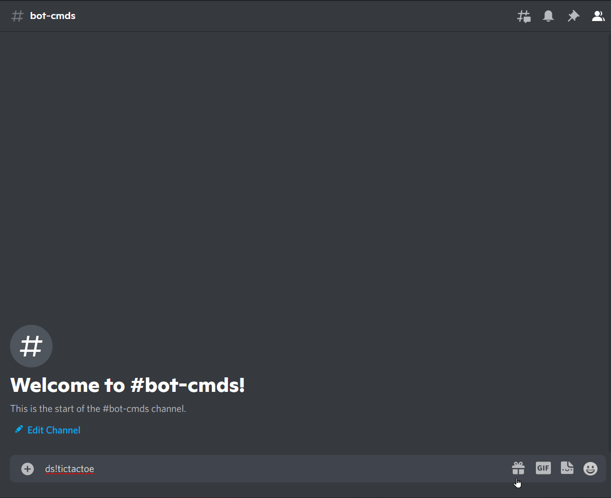

# Tictactoe

### What is Tictactoe

Tic-tac-toe is a paper-and-pencil game for two players who take turns marking the spaces in a three-by-three grid with X or O. The player who succeeds in placing three of their marks in a horizontal, vertical, or diagonal row is the winner. It is a solved game, with a forced draw assuming best play from both players.

Source: [Wikipedia](https://en.wikipedia.org/wiki/Sudoku)

### How to play

!!! warning

    Replace {prefix} with the prefix of your bot.

`{prefix}tictactoe [@user]`

| Name | Requested Type |
| :-- | :-- |
| **Member** | Member ([discord.Member](https://discordpy.readthedocs.io/en/latest/api.html?highlight=member#discord.Member) e.g @user) |

!!! info  inline end
    Member is an opetional parameter.

    If not member is inputted, you will play against the bot.

### Permissions

??? tdlr "Permissions Required"
    | Name | Description |
    | :-- | :-- |
    | **Manage messages** | Manage messages |
    | **Send messages** | Send messages |
    | **Embed links** | Sending embeds |

### Errors

??? tdlr "Possible Errors"
    | Name | Reason |
    | :-- | :-- |
    | **MissingPermissions** ([discord.ext.commands.BotMissingPermissions](https://discordpy.readthedocs.io/en/latest/ext/commands/api.html?highlight=missing#discord.ext.commands.BotMissingPermissions)) | You did not give the bot permission for it to play the game |
    | **TimeoutError** ([asyncio.TimeoutError](https://docs.python.org/3/library/asyncio-exceptions.html?highlight=timeouterror#asyncio.TimeoutError)) | You did not answer/respond in time. |
    | **Message NotFound** ([discord.NotFound](https://discordpy.readthedocs.io/en/latest/api.html?highlight=notfound#discord.NotFound)) | The message was deleted |

!!! tip
    If the error you got is not documented. Feel free to contribute [here](https://github.com/andrewthederp/Disgames/docs/mixins/tictactoe.md)
