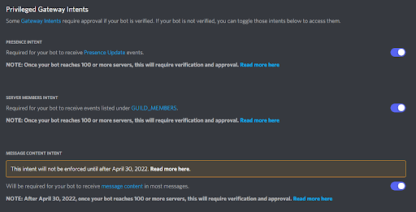

# Basic Bot Setup

You might wanna add disgames to your bot! Here how to do it.

If you don't know what you are doing, you might wanna read everything

1. Create a bot account
    Create a bot at [developer portal](https://discordapp.com/developers/applications/me)

    If you need some help you can check this [guide](https://docs.pycord.dev/en/master/discord.html) out

    You also need intents to be on:

    

2. Install the library

    !!! warning
        Make sure you have python and pip installed. Install python [here](https://www.python.org/downloads/)

        Pip needs to be in path for it to work

    Run this in your terminal:

    ```python
    # Py-cord is an python library that is popular for discord bots. If you like discord.py you can replace py-cord with discord.py
    # We are installing 2 modules at the same time

    # Windows
    py -3 -m pip install py-cord disgames

    # MacOS and Linux
    python3 -m pip install py-cord disgames
    ```

3. Writing your bot

    Create a file with a name like `main.py` or `bot.py` or anything that ends with .py

    Inside you can put this code in:

    !!! warning
        Please do not leave `your bot prefix` or `your token here` in the code. Please replace it with your bot prefix and your token.

    !!! tip inline end
        Stockfish path is optional. If you want to input it. Please choose stockfish as stockfish_20011801_32bit.exe. You can rename it to that

        Ignore only takes in a list of commands you want to ignore. E.g. `ignore=[Chess]` Where Chess is imported like

        `from disgames.mixins.chess import Chess`

    ```python
    from discord.ext import commands
    from disgames import register_commands
    import discord

    client = commands.Bot(command_prefix='your bot prefix', intents=discord.Intents.all())

    register_commands(client, ignore=[], stockfish_path=None, ttt_reactions=False) # defualt


    client.run('your token here')
    ```

4. Run the bot and enojy!

    So run the bot by using this command in the terminal

    !!! warning
        Make sure you are in the directory where your python file is at or it will not work.

    ```python
    python3 yourpythonfilename.py
    ```
